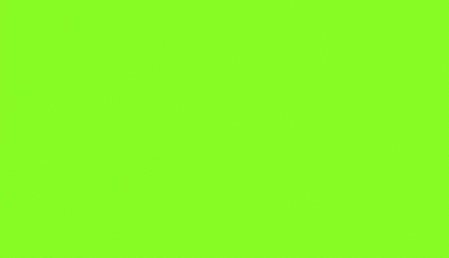

 

 ## Olá! Meu nome é Adriano Barroso.
 <image src="image/Developer activity-bro.png" align=right width=350px height=350px>

- 📖 Atualmente apreendendo JavaScript
- 🏫 Cursando Coding na [UNINASSAU](https://www.uninassau.edu.br/)

 
### 📫 Contato:

<a href="">
    <image src="https://img.shields.io/badge/Telegram-2CA5E0?style=for-the-badge&logo=telegram&logoColor=white">
</a>
<a href="mailto:adrianofilho1301@gmail.com">
    <image src="https://img.shields.io/badge/Gmail-D14836?style=for-the-badge&logo=gmail&logoColor=white">
</a>

### 📷 Social:

<a href="">
  <image src="https://img.shields.io/badge/Instagram-E4405F?style=for-the-badge&logo=instagram&logoColor=white">
</a>
  
<a href="">
  <image src="https://img.shields.io/badge/Twitter-1DA1F2?style=for-the-badge&logo=twitter&logoColor=white">
</a>

## | Linguaguens e Marcações atualmente utilizadas:
<image src="https://img.shields.io/badge/HTML5-E34F26?style=for-the-badge&logo=html5&logoColor=white"> <image src="https://img.shields.io/badge/CSS3-1572B6?style=for-the-badge&logo=css3&logoColor=white"> <image src="https://img.shields.io/badge/JavaScript-F7DF1E?style=for-the-badge&logo=javascript&logoColor=black"> <image src="https://img.shields.io/badge/Markdown-000000?style=for-the-badge&logo=markdown&logoColor=white">

  
  

 